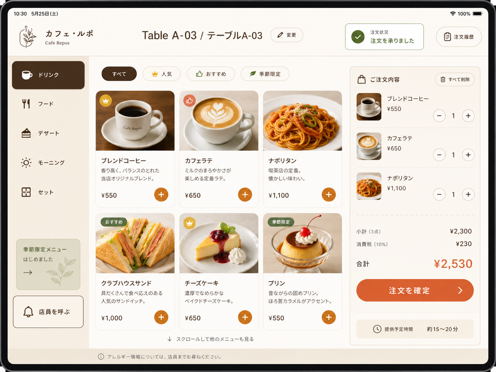
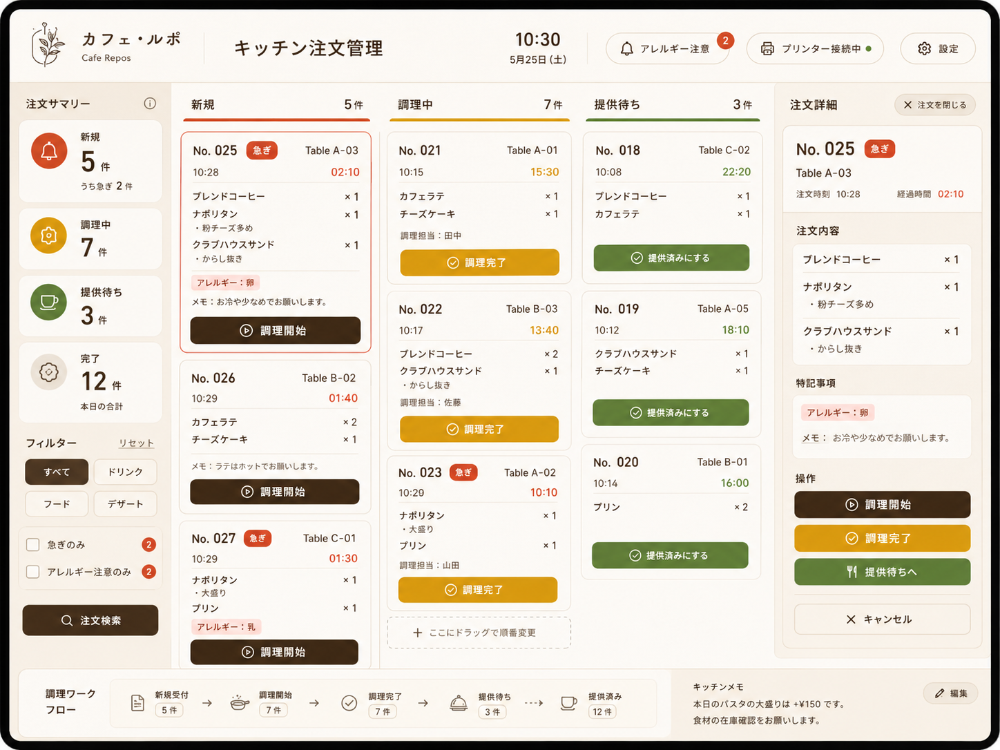
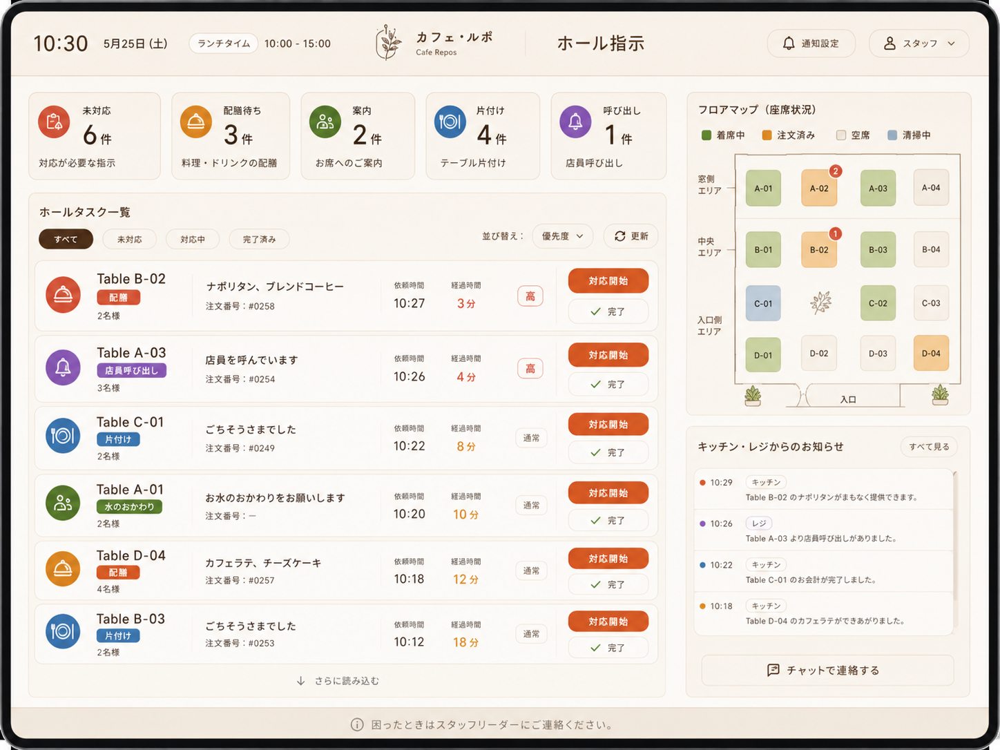
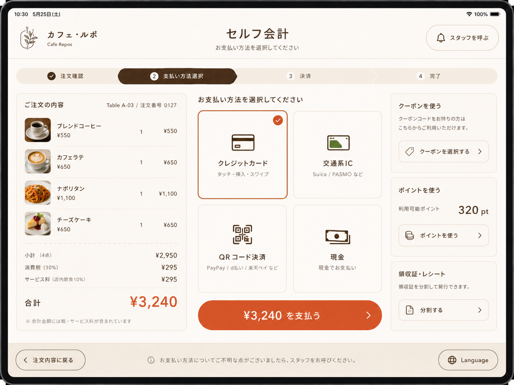
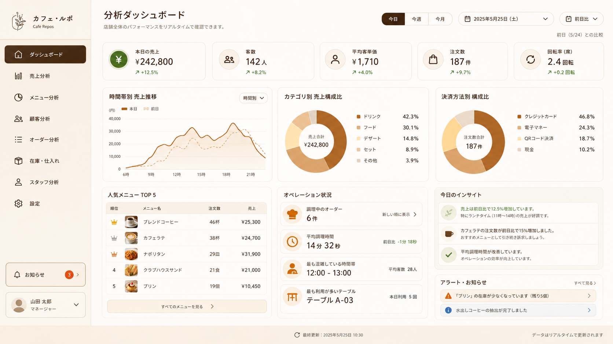

# 05 Screen Spec

## 画面一覧

- `/login`
- `/customer/T01`
- `/kitchen`
- `/hall`
- `/checkout`
- `/analytics`
- `/admin/menu`
- `/admin/tables`
- `/admin/orders`
- `/admin/audit-logs`
- `/admin/users`

## `/login`

- 目的: スタッフ、管理者、閲覧専用ユーザーがログインする。
- 主な利用者: キッチンスタッフ、ホールスタッフ、レジ担当、店長 / 管理者、閲覧専用ユーザー。
- 主な表示項目: ログイン ID、password、端末コード、エラー表示。
- 主な操作: ログイン。
- 必要な role: 全員。未ログインで利用する。
- 関連 API: `POST /api/auth/login`, `GET /api/auth/me`
- 注意点: ログイン成功後は role に応じた protected 画面へ遷移する。連続ログイン失敗で一時ロックされる。

## `/customer/:tableCode`

- 目的: 顧客が席端末からセルフ注文、スタッフ呼び出し、会計依頼を行う。
- 主な利用者: 顧客。
- 主な表示項目: カテゴリ、商品カード、商品画像、画像未設定 / 読み込み失敗時の fallback、売切 / 低在庫表示、オプション選択、カート、注文履歴、会計状態。
- 主な操作: 席セッション開始、商品追加、オプション選択、注文確定、スタッフ呼び出し、会計依頼。
- 必要な role: ログイン不要。顧客端末。
- 関連 API: `GET /api/customer/menu`, `POST /api/customer/session/open`, `GET /api/customer/session/current`, `POST /api/customer/order/submit`, `GET /api/customer/order/history`, `POST /api/customer/payment/request`, `POST /api/customer/staff-call`
- 注意点: 会計依頼後または精算済みの席では注文操作をロックする。売切商品は注文不可。`track_stock=true` かつ `stock_quantity=0` の商品は売切表示、`stock_quantity <= low_stock_threshold` の商品は残りわずか表示にする。商品画像 URL がある場合はカード上部に表示し、未設定または読み込み失敗時は固定サイズの「画像なし」fallback を表示してレイアウトを保つ。注文直前に在庫不足になった場合は API エラーを表示する。

## `/kitchen`

- 目的: 注文明細単位で調理状態を管理する。
- 主な利用者: キッチンスタッフ、店長 / 管理者。
- 主な表示項目: `ordered`, `accepted`, `cooking`, `ready` のカンバン、経過時間、商品名、数量、オプション、メモ、アレルギー。
- 主な操作: `ordered -> accepted -> cooking -> ready` への状態更新。
- 必要な role: `kitchen` / `manager`
- 関連 API: `GET /api/kitchen/tickets`, `POST /api/kitchen/item/status`
- 注意点: `ready` になると配膳タスクを生成する。キッチン画面から `served` にはしない。

## `/hall`

- 目的: 配膳、スタッフ呼び出し、会計サポート、片付けタスクを処理する。
- 主な利用者: ホールスタッフ、店長 / 管理者。
- 主な表示項目: タスク種別、席、優先度、状態、メモ、簡易フロアマップ。
- 主な操作: タスク開始、タスク完了。
- 必要な role: `hall` / `manager`
- 関連 API: `GET /api/hall/tasks`, `POST /api/hall/task/status`
- 注意点: 配膳タスク完了で注文明細を `served` にする。片付け完了で席を `available` に戻す。

## `/checkout`

- 目的: 会計依頼済みの席を精算する。
- 主な利用者: レジ担当、店長 / 管理者。
- 主な表示項目: 席カード、レシート風明細、選択オプション、小計、税、合計、支払い方法、payment 検索、再発行レシート、返金履歴、返金済み badge。
- 主な操作: 席選択、支払い方法 `cash` / `card` / `qr` 選択、精算確定、`payment_no` / `payment_id` でのレシート検索、レシート再発行、返金理由入力、全額返金。
- 必要な role: `cashier` / `manager`
- 関連 API: `GET /api/checkout/summary`, `POST /api/checkout/settle`, `GET /api/checkout/receipt`, `POST /api/checkout/refund`
- 注意点: 会計依頼済みセッションだけ精算できる。取消明細は会計対象外。返金は MVP では paid payment の全額返金のみ。レシートには原価・粗利を表示しない。外部プリンタ連携は行わず、ブラウザ表示・印刷で扱う。

## `/analytics`

- 目的: 売上、会計件数、客単価、商品別ランキング、支払い方法別集計を確認する。
- 主な利用者: 店長 / 管理者、閲覧専用ユーザー。
- 主な表示項目: KPI、商品ランキング、支払い方法別集計、最終更新時刻。
- 主な操作: 期間指定、売上 / 原価 / 粗利 / 粗利率の確認、商品別粗利確認、CSV ダウンロード、管理画面への遷移。
- 必要な role: `manager` / `viewer`
- 関連 API: `GET /api/analytics/summary`, `GET /api/analytics/item-ranking`, `GET /api/analytics/export-sales-csv`
- 注意点: CSV は JSON 内の `csv` をフロントエンドが Blob 化して保存する。原価・粗利は管理 / 分析向け情報で、顧客画面には表示しない。

## `/admin/menu`

- 目的: メニューカテゴリ、商品、商品オプションを管理する。
- 主な利用者: 店長 / 管理者。
- 主な表示項目: カテゴリ一覧、カテゴリ商品数、商品一覧、商品サムネイル、商品フォーム、商品画像 URL 入力、商品画像プレビュー、表示状態、売切状態、在庫管理対象、現在在庫数、低在庫閾値、低在庫警告、在庫調整フォーム、在庫履歴、履歴種別 filter、在庫増減前後、並び順、オプショングループ、選択肢、追加料金。
- 主な操作: カテゴリ追加・編集・表示 / 非表示・並び順変更、商品追加、編集、商品画像 URL 登録・更新・クリア、表示 / 非表示、売切 / 売切解除、在庫設定更新、在庫差分調整、在庫履歴確認、並び順変更、カテゴリ絞り込み、商品名検索、オプショングループ追加・編集・表示 / 非表示・並び順変更、選択肢追加・編集・表示 / 非表示・並び順変更。
- 必要な role: `manager`
- 関連 API: `GET/POST /api/admin/menu/categories`, `POST /api/admin/menu/categories/update`, `POST /api/admin/menu/categories/toggle-active`, `POST /api/admin/menu/categories/move`, `GET /api/admin/menu/items`, `POST /api/admin/menu/items`, `POST /api/admin/menu/items/update`, `POST /api/admin/menu/items/toggle-active`, `POST /api/admin/menu/items/toggle-sold-out`, `POST /api/admin/menu/items/update-stock`, `POST /api/admin/menu/items/adjust-stock`, `GET /api/admin/menu/items/inventory-movements`, `POST /api/admin/menu/items/move`, `GET/POST /api/admin/menu/items/options`, `POST /api/admin/menu/items/options/update`, `POST /api/admin/menu/items/options/toggle-active`, `POST /api/admin/menu/items/options/move`, `POST /api/admin/menu/items/options/choices`, `POST /api/admin/menu/items/options/choices/update`, `POST /api/admin/menu/items/options/choices/toggle-active`, `POST /api/admin/menu/items/options/choices/move`
- 注意点: 商品が属するカテゴリを非表示にすると、顧客注文画面ではカテゴリごと非表示になる。`track_stock=false` の場合は在庫数入力と差分調整を無効化する。`update-stock` は現在在庫の直接設定、`adjust-stock` は 0 以外の整数差分での補充・減算・棚卸調整として使う。`stock_quantity=0` は売切化を促し、注文成功または在庫調整で在庫 0 になった場合は自動で `sold_out=true` になる。売切解除は管理者操作で行う。商品画像 URL は空値、`http(s)`、または `/` から始まるパスだけ許可する。画像未設定または読み込み失敗時は一覧とプレビューに「画像なし」を表示する。標準原価は 0 以上の整数で、販売価格を超える場合は赤字警告を表示する。本格的な商品画像アップロード、仕入 / 入荷 / 棚卸は後続対応。

## `/admin/tables`

- 目的: 席、席セッション、顧客端末、スタッフ端末を管理する。
- 主な利用者: 店長 / 管理者。
- 主な表示項目: 席一覧、席状態、顧客端末紐付け、現在セッション、注文・会計状態、端末一覧。
- 主な操作: 席状態変更、セッション強制クローズ、端末有効 / 無効切替、席詳細確認。
- 必要な role: `manager`
- 関連 API: `GET /api/admin/tables`, `GET /api/admin/tables/detail`, `POST /api/admin/tables/update-status`, `POST /api/admin/tables/force-close-session`, `GET /api/admin/terminals`, `POST /api/admin/terminals/update-active`
- 注意点: 未精算注文や未提供明細があるセッションは強制クローズ不可。

## `/admin/orders`

- 目的: 注文一覧と注文詳細を確認し、条件を満たす注文・明細を取消する。
- 主な利用者: 店長 / 管理者。
- 主な表示項目: 注文一覧、日付・席・注文番号・注文状態・精算状態フィルタ、注文詳細、注文明細、選択オプション、支払い情報、payment 状態、返金履歴、関連ホールタスク。
- 主な操作: フィルタ、詳細表示、明細取消、注文全体取消。
- 必要な role: `manager`
- 関連 API: `GET /api/admin/orders`, `GET /api/admin/orders/detail`, `POST /api/admin/orders/cancel-item`, `POST /api/admin/orders/cancel-order`
- 注意点: `ordered`, `accepted`, `cooking` の明細だけ取消可能。ready / served 明細を含む注文や精算済み注文は取消不可。注文詳細では管理者向けに明細売上、明細原価、明細粗利、粗利率を表示する。返金操作は `/checkout` に寄せ、注文管理では payment 状態と返金履歴を確認する。CSV 出力は `/analytics` の売上 CSV へ誘導する。

## `/admin/audit-logs`

- 目的: 重要操作と認証イベントの監査ログを検索・確認する。
- 主な利用者: 店長 / 管理者。
- 主な表示項目: 発生日時、成功 / 失敗、操作種別、操作ユーザー名、操作ユーザーロール、操作端末コード、対象種別、対象 ID、対象ラベル、エラーメッセージ、request_data、before_data、after_data。
- 主な操作: フィルタ、キーワード検索、詳細表示、検索条件を反映した CSV エクスポート。
- 必要な role: `manager`
- 関連 API: `GET /api/admin/audit-logs`, `GET /api/admin/audit-logs/detail`, `GET /api/admin/audit-logs/export-csv`
- 注意点: 顧客操作は user actor がなく terminal actor のみになる場合がある。JSON は整形表示し、before_data / after_data は比較表示する。password / session_token / token は万一含まれていても画面表示で mask する。

## `/admin/users`

- 目的: ログインユーザーと role を管理する。
- 主な利用者: 店長 / 管理者。
- 主な表示項目: ユーザー一覧、login ID、表示名、role、active、作成・更新日時。
- 主な操作: ユーザー作成、表示名・role・password 更新、有効 / 無効切替、検索。
- 必要な role: `manager`
- 関連 API: `GET /api/admin/users`, `POST /api/admin/users`, `POST /api/admin/users/update`, `POST /api/admin/users/toggle-active`
- 注意点: 最後の active manager の無効化・降格と、自分自身の manager 権限変更は拒否する。
