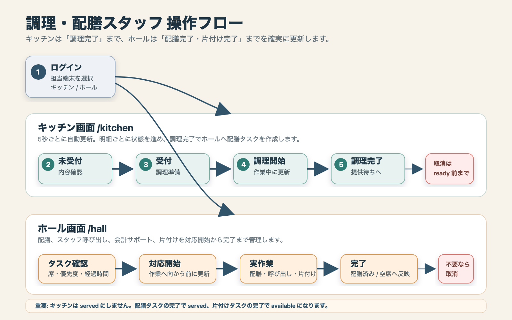

# 09 Staff Manual: 調理・配膳スタッフ向け操作説明書

## 対象

この説明書は、調理を担当するキッチンスタッフと、配膳・呼び出し・片付けを担当するホールスタッフ向けです。

対象画面:

- `/login`: スタッフログイン
- `/kitchen`: キッチン注文管理
- `/hall`: ホール指示

## ログイン

1. `/login` を開く。
2. 店舗から配布されたログイン ID とパスワードを入力する。
3. 端末を選ぶ。
   - キッチン担当: `キッチン端末`
   - ホール担当: `ホール端末`
4. `ログイン` を押す。

ログイン後、権限に応じた画面へ移動する。ログインに連続して失敗すると、一時的にロックされる。

## キッチン注文管理

`/kitchen` は注文明細ごとに調理状態を進める画面で、5 秒ごとに自動更新される。

### 画面の見方

- `未受付`: 顧客から送信された直後の注文。
- `受付済み`: キッチンが注文を確認済みで、調理開始待ち。
- `調理中`: 調理作業中。
- `提供待ち`: 調理完了済み。ホールへ配膳タスクが連携済み。

各カードには、席番号、席名、経過時間、商品名、数量、注文番号、オプション、メモ、アレルギー情報が表示される。

### 調理の基本手順

1. `未受付` のカードを確認する。
2. 商品名、数量、オプション、メモ、アレルギー表示を確認する。
3. 調理できる注文は `受付` を押す。
4. 実際に調理を始めたら `調理開始` を押す。
5. 調理が終わったら `調理完了` を押す。

`調理完了` にすると明細は `提供待ち` になり、ホール画面に配膳タスクが作成される。キッチン画面では提供済みにはしない。

### 取消

`未受付`、`受付済み`、`調理中` のカードでは `取消` が使える。調理完了後の `提供待ち` や配膳済みの明細は、キッチン画面から取消しない。

取消が必要か判断できない場合は、ホールまたはマネージャーへ確認する。

### 経過時間の確認

経過時間はカード右上に表示される。長く待っている注文は警告色で表示されるため、優先して確認する。

## ホール指示

`/hall` は配膳、スタッフ呼び出し、会計サポート、片付けを処理する画面で、5 秒ごとに自動更新される。

### 画面の見方

- `フロア`: T01 から T04 の簡易席状態を表示する。
- `スタッフ呼び出し`: 顧客が席端末の `スタッフ呼出` を押したタスク。
- `配膳`: キッチンで `調理完了` になった商品の配膳タスク。
- `会計サポート`: 顧客が `会計依頼` した席の対応タスク。
- `片付け`: 精算後の片付けタスク。

タスクカードには、席番号、タスク種別、状態、内容、優先度、経過時間が表示される。

### タスク対応の基本手順

1. 優先度と経過時間を確認する。
2. 対応を始めるタスクで `対応開始` を押す。
3. 実作業を行う。
4. 完了したら `完了` を押す。

配膳タスクを `完了` にすると、対象の注文明細が `served` になる。片付けタスクを `完了` にすると、席が `available` に戻る。

### タスク別の対応

#### 配膳

1. 商品名、数量、席番号を確認する。
2. キッチンから商品を受け取る。
3. 対象の席へ配膳する。
4. 配膳後に `完了` を押す。

配膳前に内容が違う場合は、`完了` を押さずにキッチンまたはマネージャーへ確認する。

#### スタッフ呼び出し

1. `スタッフ呼び出し` タスクの席へ向かう。
2. 顧客の要望を確認する。
3. 対応が終わったら `完了` を押す。

追加注文が必要な場合は顧客端末で操作してもらう。会計依頼後は新規注文できない。

#### 会計サポート

1. `会計サポート` タスクの席を確認する。
2. 顧客へ、レジで会計処理を行うことを案内する。
3. 必要な案内が終わったら `完了` を押す。

実際の精算処理は `/checkout` でレジ担当またはマネージャーが行う。

#### 片付け

1. 精算済みの席を片付ける。
2. 忘れ物や未回収食器を確認する。
3. 清掃が完了したら `完了` を押す。

片付け完了により席は空席扱いになる。

### 取消

誤って作成されたタスクや対応不要になったタスクは `取消` を押す。判断に迷う場合はマネージャーへ確認する。

## よくある状態と対応

- 注文が表示されない: 5 秒待っても変わらない場合は、画面を再読み込みする。
- ボタンが押せない: ほかの操作中、完了済み、または権限外の可能性がある。
- API エラーが出る: 同じ注文やタスクを別端末が先に更新した可能性がある。再読み込みして現在状態を確認する。
- アレルギー表示がある: 必ず内容を確認し、店舗ルールに従って対応する。

## 注意事項

- キッチンは `調理完了` までを担当し、提供済みへの更新はホールで行う。
- ホールの配膳 `完了` は、実際に配膳が終わってから押す。
- 顧客端末から送られた会計金額は使用しない。会計金額はサーバー側の注文情報から計算される。
- 売切、在庫不足、取消判断、精算後の返金はマネージャーまたはレジ担当へ引き継ぐ。
