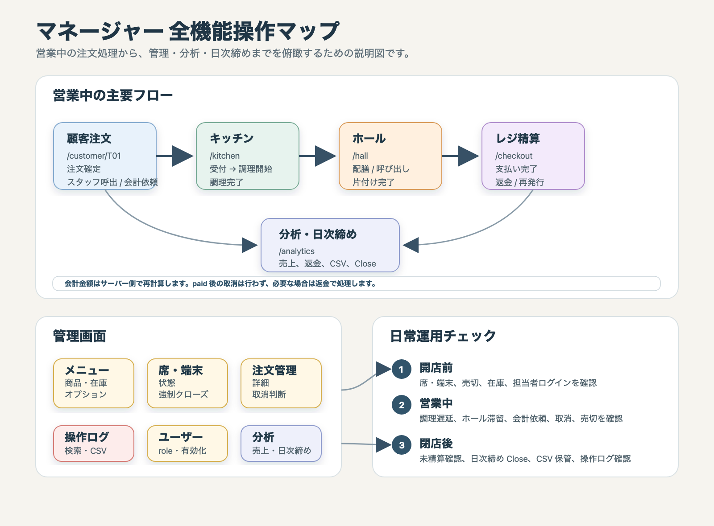

# 10 Manager Manual: マネージャー向け操作説明書

## 対象

この説明書は、店長 / 管理者がシステム全体を操作・確認するためのものです。マネージャーは、キッチン、ホール、レジ、分析、各管理画面を利用できます。

対象画面:

- `/login`: ログイン
- `/customer/:tableCode`: 顧客注文画面
- `/kitchen`: キッチン注文管理
- `/hall`: ホール指示
- `/checkout`: レジ精算
- `/analytics`: 分析ダッシュボード、日次締め
- `/admin/menu`: メニュー管理
- `/admin/tables`: 席・端末管理
- `/admin/orders`: 注文管理
- `/admin/audit-logs`: 操作ログ
- `/admin/users`: ユーザー管理



## ログインと権限

1. `/login` を開く。
2. マネージャー用のログイン ID とパスワードを入力する。
3. 端末は通常 `店長 PC` を選ぶ。
4. `ログイン` を押す。

マネージャーは管理 API を利用できる。最後の有効な manager を無効化または降格する操作、自分自身の manager 権限変更は拒否される。

## 顧客注文画面

`/customer/T01` のように席コード付き URL で開く。顧客はログイン不要で利用する。

主な機能:

- 席セッション開始
- カテゴリ別メニュー表示
- 商品画像、価格、アレルギー、売切、残りわずか表示
- オプション選択
- メモ入力
- カート追加、数量変更、削除
- 注文確定
- 注文履歴確認
- スタッフ呼び出し
- 会計依頼

会計依頼後または精算済みの席では、新規注文とカート操作がロックされる。売切商品は注文できない。

## キッチン注文管理

`/kitchen` で注文明細の調理状態を管理する。マネージャーもキッチン権限として利用できる。

状態遷移:

```txt
ordered -> accepted -> cooking -> ready
```

操作:

- `受付`: 未受付の明細を受け付ける。
- `調理開始`: 受付済み明細を調理中にする。
- `調理完了`: 調理中明細を提供待ちにする。
- `取消`: `ordered`、`accepted`、`cooking` の明細を取消する。

`ready` になるとホールに配膳タスクが作成される。キッチン画面から `served` にはしない。

## ホール指示

`/hall` で配膳、スタッフ呼び出し、会計サポート、片付けを管理する。

操作:

- `対応開始`: タスクを処理中にする。
- `完了`: タスクを完了する。
- `取消`: 不要なタスクを取消する。

重要な副作用:

- 配膳タスクの `完了` で注文明細が `served` になる。
- 片付けタスクの `完了` で席が `available` に戻る。

## レジ精算

`/checkout` で会計依頼済みの席を精算する。

### 通常精算

1. `テーブル選択` で会計依頼済みの席を選ぶ。
2. レシート表示の明細、小計、税、合計を確認する。
3. 支払い方法を選ぶ。
   - `現金`
   - `カード`
   - `QR`
4. `支払い完了` を押す。
5. 領収書番号が表示されたことを確認する。

精算金額はサーバー側で注文・オプション・税率から計算される。フロントエンドから送られた金額は会計処理に使用しない。

### 支払い失敗

1. 対象席を選ぶ。
2. `失敗理由` を入力する。
3. `失敗として処理` を押す。

失敗した決済は売上に含まれない。席は会計依頼中のまま残るため、再度 `支払い完了` で再試行できる。

### 決済試行取消

`決済試行履歴` で pending または failed の attempt は `取消` できる。取消後も再試行できる。paid 後の取消は行わず、返金を使う。

### レシート再発行

1. `レシート再発行・返金` で `payment_no` または `payment_id` を入力する。
2. `検索` で内容を確認する。
3. 必要に応じて `再発行` を押す。

レシートには支払日時、支払方法、provider、返金済み合計、返金可能残額、明細、小計、税、支払合計が表示される。

### 返金

1. レシートを検索する。
2. 返金可能残額を確認する。
3. 部分返金の場合は `返金額` と必要に応じて `返金理由` を入力する。
4. `部分返金` または `残額全額返金` を押す。

返金は payment 単位で行う。返金可能残額を超える金額は拒否される。返金しても注文・明細・席セッションの履歴は削除されない。

### 外部決済連携テスト

`外部決済連携テスト` は mock provider 用の開発機能である。`internal` は内部ダミー決済、`mock` は外部決済サービスを模した provider として扱う。実 Stripe、Square、PayPay などには接続しない。

## 分析ダッシュボード

`/analytics` で売上と日次締めを確認する。

### 売上確認

1. 画面上部の日付範囲を指定する。
2. KPI を確認する。
   - 総支払額
   - 返金額
   - 純売上
   - 原価合計
   - 粗利合計
   - 粗利率
   - 会計件数
   - 注文件数
   - 平均客単価
3. 商品ランキングと支払い方法別集計を確認する。
4. 必要に応じて `CSV ダウンロード` を押す。

failed / cancelled の決済試行は売上金額に含まれない。部分返金済みの payment は、支払額から返金累計を差し引いた純売上に反映される。

### 日次締め

1. `日次締め` の営業日を選ぶ。
2. `Preview` を押して、総支払額、返金額、純売上、税額、原価、粗利、決済手段別、provider 別、payment status 件数を確認する。
3. 必要に応じて `締めメモ` を入力する。
4. 問題なければ `Close` を押す。
5. 保管用に `日次締め CSV` をダウンロードする。

締め直しが必要な場合:

1. `Reopen 理由` を入力する。
2. `Reopen` を押す。
3. 修正後、再度 `Preview` と `Close` を行う。

日次締めの `Close` と `Reopen` は manager のみ可能である。

## メニュー管理

`/admin/menu` でカテゴリ、商品、在庫、商品オプションを管理する。

### カテゴリ

操作:

- カテゴリ名と表示順を入力して `追加`。
- 既存カテゴリの `編集` 後に `更新`。
- `表示` / `非表示` の切替。
- `上へ` / `下へ` で並び順変更。

非表示カテゴリの商品は、顧客注文画面にカテゴリごと表示されない。

### 商品

操作:

- `新規商品追加` で新規フォームを開く。
- カテゴリ、商品名、説明、価格、税率、標準原価、アレルギー、画像 URL、表示順などを入力する。
- `保存` で登録または更新する。
- 商品一覧から `編集`、`表示` / `非表示`、`売切` / `解除`、`上へ` / `下へ` を操作する。

商品画像 URL は空値、`http://`、`https://`、または `/` から始まるパスを使う。画像アップロード機能は未対応。

### 在庫

在庫管理対象の商品では、現在在庫数と低在庫閾値を管理できる。

- `在庫のみ更新`: 現在在庫数などを直接保存する。
- `差分調整`: 補充、減算、棚卸調整を整数差分で記録する。
- 在庫履歴: `直接設定`、`差分調整`、`注文引当`、`取消戻し` などを確認する。

在庫が 0 になると売切扱いになる。1 以上に戻しても売切解除は自動では行わず、管理者が明示的に `解除` する。

### 商品オプション

保存済み商品では、オプショングループと選択肢を管理できる。

オプショングループ:

- 名前
- 必須 / 任意
- 単一 / 複数
- 最小選択数
- 最大選択数
- 表示順
- 表示 / 非表示

選択肢:

- 選択肢名
- 追加料金
- 表示順
- 表示 / 非表示

オプション追加料金は注文時点の金額が会計・分析に使われる。後からメニュー定義を変更しても既存注文の金額は変わらない。

## 席・端末管理

`/admin/tables` で席、席セッション、顧客端末、スタッフ端末を管理する。

### 席一覧と詳細

検索や状態フィルタで席を絞り込み、席カードを選ぶと詳細を確認できる。

確認できる情報:

- 席状態
- 現在セッション
- 注文一覧
- 未提供明細
- 支払い情報
- 関連ホールタスク

操作:

- `空席にする`: 席を available にする。
- `使用停止`: 席を disabled にする。
- `セッション強制クローズ`: 条件を満たすセッションを強制終了する。

未精算注文または未提供明細があるセッションは強制クローズできない。

### 端末一覧

顧客端末、キッチン端末、ホール端末、レジ端末、店長 PC などの有効 / 無効を切り替える。無効な端末からの操作は拒否される。

## 注文管理

`/admin/orders` で注文一覧と詳細を確認し、条件を満たす注文や明細を取消できる。

### 検索

条件:

- 日付範囲
- 席コード
- 注文番号
- 注文状態
- 精算状態

`更新` で一覧を再取得する。

### 詳細確認

注文一覧の `詳細` を押すと、注文明細、選択オプション、売上、原価、粗利、支払い情報、決済試行履歴、関連ホールタスクを確認できる。

### 明細取消

`ordered`、`accepted`、`cooking` の明細だけ取消できる。`ready`、`served`、精算済み明細は取消できない。

取消明細は会計、売上分析、商品ランキング、売上 CSV から除外される。

### 注文全体取消

未精算で、ready / served 明細を含まない注文だけ取消できる。精算済み注文の取消は行わず、必要に応じて `/checkout` で返金する。

## 操作ログ

`/admin/audit-logs` で認証、顧客操作、会計、管理操作などの監査ログを確認する。

検索条件:

- 操作種別
- 対象種別
- 成功 / 失敗
- ユーザーロール
- 端末コード
- ユーザー ID
- キーワード

操作:

- `更新`: 条件に合うログを再取得する。
- `詳細`: request、変更前、変更後、エラー内容などを確認する。
- `CSV 出力`: 検索条件を反映した CSV を出力する。

password、session token、生 token は画面表示でマスクされる。

## ユーザー管理

`/admin/users` でログインユーザーと role を管理する。

ロール:

- `manager`: 全管理機能を利用可能。
- `kitchen`: キッチン画面を利用可能。
- `hall`: ホール画面を利用可能。
- `cashier`: レジ精算画面を利用可能。
- `viewer`: 分析画面の閲覧が可能。

操作:

- 新規ユーザー作成。
- 表示名変更。
- role 変更。
- パスワード変更。
- 有効化 / 無効化。
- 検索。

最後の active manager の無効化・降格、自分自身の manager 権限変更は拒否される。

## 日常運用の推奨順

### 開店前

1. `/admin/tables` で席と端末が有効であることを確認する。
2. `/admin/menu` で売切、在庫、表示 / 非表示を確認する。
3. 必要に応じてキッチン、ホール、レジ担当が `/login` できることを確認する。

### 営業中

1. `/kitchen` で調理遅延を確認する。
2. `/hall` で呼び出し、配膳、片付けの滞留を確認する。
3. `/checkout` で会計依頼済み席を精算する。
4. 取消が必要な場合は `/admin/orders` で状態を確認して操作する。
5. 売切や在庫不足が出たら `/admin/menu` で反映する。

### 閉店後

1. `/checkout` で未精算席がないことを確認する。
2. `/admin/tables` で未提供明細や未完了タスクが残っていないことを確認する。
3. `/analytics` で当日の売上と返金を確認する。
4. `日次締め` の `Preview` を確認し、問題なければ `Close` する。
5. 売上 CSV と日次締め CSV を保存する。
6. 必要に応じて `/admin/audit-logs` で失敗操作や重要操作を確認する。

## 制約と注意事項

- 実決済サービス連携は未対応で、mock provider は開発用である。
- paid 後の取消は行わず、返金として処理する。
- 返金は payment 単位で、明細別返金は未対応である。
- 商品画像アップロード、仕入 / 入荷 / 棚卸の専用フロー、複数店舗、予約、顧客会員は未対応である。
- NyanQL は内部 API として扱い、顧客端末やフロントエンドから直接呼び出さない。
- DB スキーマや状態遷移を変更する場合は、仕様ドキュメントと開発メモを更新する。
